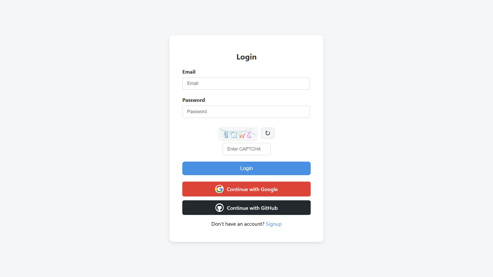
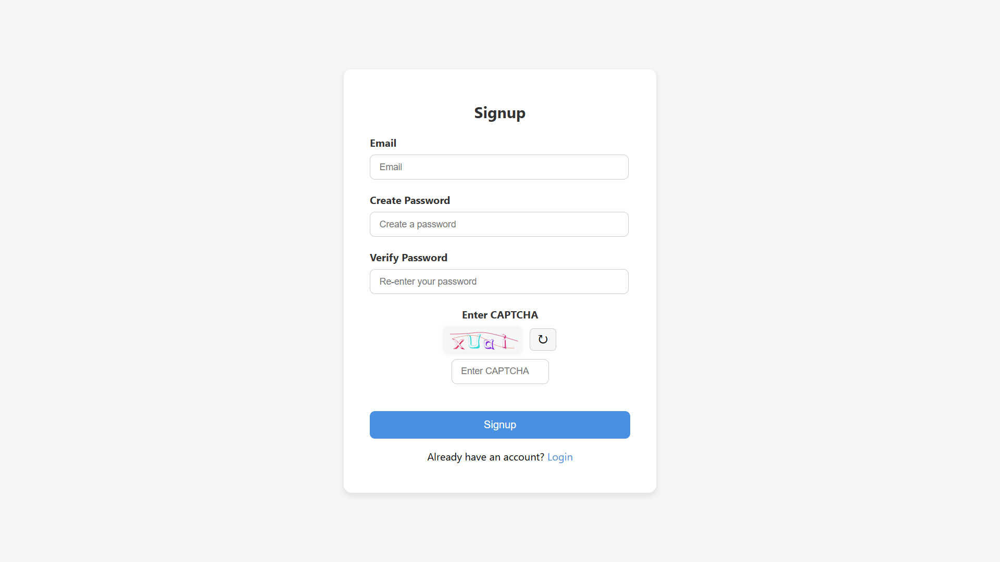

# Node.js + Express.js Authentication Web App

A modern authentication web app built with Node.js, Express.js, and MongoDB. Supports email/password login, Google & GitHub OAuth, password strength meter, CAPTCHA, and more—all with clean EJS views and professional UI.

---

## 📁 Folder Structure

```
├── models/         # Mongoose schemas (User, Auth logic)
├── public/         # Static assets (CSS, images)
├── routes/         # Express route handlers (auth, OAuth, etc.)
├── src/            # App entrypoint, Passport config
├── views/          # EJS templates for all pages
├── .env            # Environment variables (not committed)
├── package.json    # Project metadata & dependencies
```

- **models/**: User schema and authentication logic
- **public/**: CSS styles and static files
- **routes/**: All Express route definitions (login, signup, OAuth, etc.)
- **src/**: Main app file (`index.js`), Passport strategies
- **views/**: EJS templates for login, signup, home, etc.

---

## ✨ Features Overview

- Email + password signup & login
- Google and GitHub OAuth login (Passport.js)
- Password strength meter (Weak, Good, Strong)
- Show/hide password toggle
- Popup messages for errors and success
- Session-based authentication
- CAPTCHA (svg-captcha) on login & signup
- Real-time form validation with visual feedback
- Protected home/dashboard page (requires login)
- Clean, responsive EJS views and CSS

---

## 🛠️ Tech Stack

-  **Node.js** &  **Express.js**
-  **MongoDB** &  **Mongoose**
-  **Passport.js** (local, Google, GitHub strategies)
-  **bcrypt** (password hashing)
-  **express-session** (session management)
-  **svg-captcha** (CAPTCHA images)
-  **express-rate-limit** (rate limiting)
-  **EJS** (templating)
-  **CSS** (custom, modern UI)

---

## 📸 Screenshots

Login Page: 



Signup Page:



---

## 📝 License

MIT License. See [LICENSE](LICENSE) for details.
